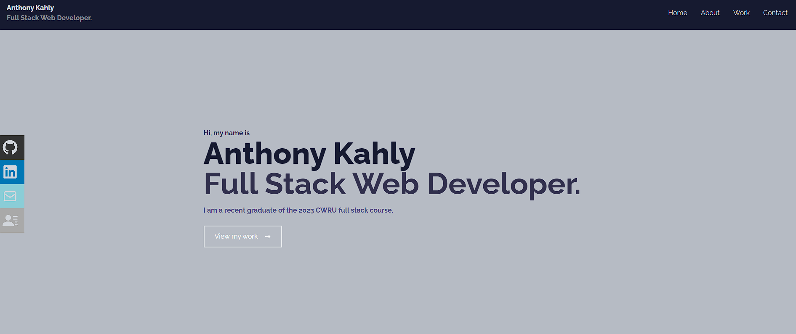

# 20 React Portfolio

# Table of Contents

- [Description](#description)
- [Process](#installation)
- [Usage](#usage)
- [License](#license)

- [Contributors](#contributors)
- [Questions](#questions)

## Description

This portfolio is a combination of the skills I have learned using REACT. I built this site with a potential employer in mind, for the purpose of using this as a future resume.

## Installation

Users will need to run `npm install` to download all project dependencies.

## Usage

User will need to enter the command `npm start` into their terminal to start the application.

## Licenses

    This project is covered under the MIT license. To learn more about what this means, click the license button at the top.

## Contributors

This project is not currently open to new contributors as it was a portfolio piece for the 2023 CWRU course.

## Questions

Have questions about this project?  
 GitHub: https://github.com/AnthonyKahly  
 Email: Akahly@gmail.com
